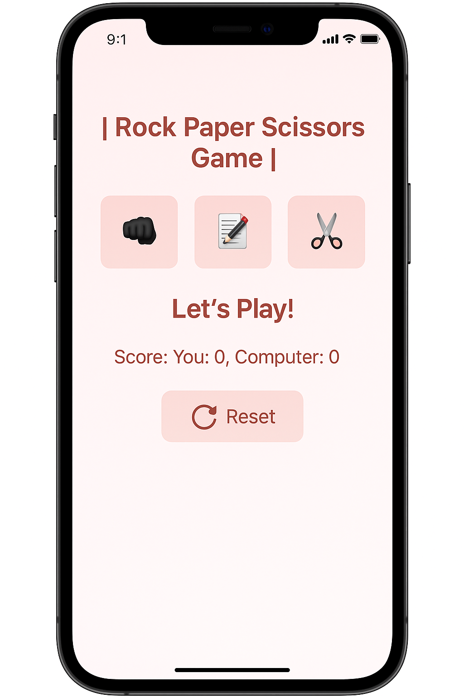

🕹️ **Rock Paper Scissors Game – 1 Minute Challenge!**

I created a simple Rock Paper Scissors game using **HTML, CSS, and JavaScript**. The game includes:

✅ Fun emojis for rock, paper, and scissors
✅ Score tracking for player vs computer
✅ A 1-minute time limit using `setTimeout` – after that, the game ends automatically! ⏰
✅ Mobile-responsive layout with smooth button effects

This project helped me improve my **JavaScript logic, DOM manipulation**, and beginner-friendly game development skills.

👩‍💻 Built with:

* HTML
* CSS
* JavaScript (`setTimeout`, events, and conditions)

Mentored by: **Sheik Hafsa Nadeem** 💡

#JavaScript #WebDevelopment #BeginnerProject #FrontendDeveloper #RockPaperScissors #CodingFun #HTML #CSS #JS

